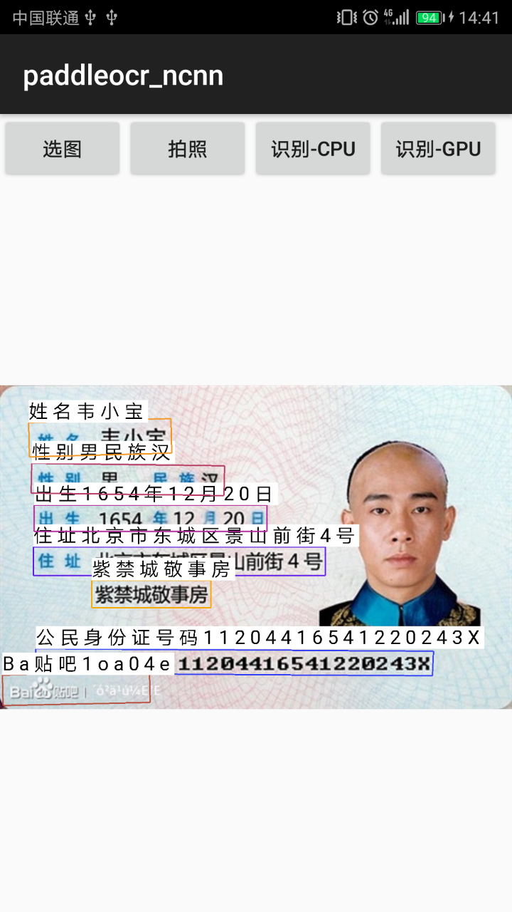

# ncnn_paddleocr
This is a sample paddleocr ncnn android project, it depends on ncnn library and opencv  
https://github.com/Tencent/ncnn  
https://github.com/nihui/opencv-mobile

convert paddleocr light model to ncnn,you can use it by ncnn.  
the infer code you can use chineseocr_lite project.  
PS：if you use angle model plz change the input shape dstHeight from 32 to 48  
# model support  
## text detection  
1.mv3dbnet-sim-op(paddleocr_mobile)  
2.pdocrv2.0_det-op(PP-OCRv2)  
3.ch_PP-OCRv3_det(PP-OCRv3)
## text angle cls  
1.angle-sim-op  
## text recognition  
1.mv3rec-sim-op(paddleocr_mobile)  
2.pdocrv2.0_rec-op(PP-OCRv2)  
3.ch_PP-OCRv3_rec(PP-OCRv3)
## how to build and run
### step1
https://github.com/Tencent/ncnn/releases

* Download ncnn-YYYYMMDD-android-vulkan.zip or build ncnn for android yourself
* Extract ncnn-YYYYMMDD-android-vulkan.zip into **app/src/main/jni** and change the **ncnn_DIR** path to yours in **app/src/main/jni/CMakeLists.txt**

### step2
https://github.com/nihui/opencv-mobile

* Download opencv-mobile-XYZ-android.zip
* Extract opencv-mobile-XYZ-android.zip into **app/src/main/jni** and change the **OpenCV_DIR** path to yours in **app/src/main/jni/CMakeLists.txt**

### step3
* Open this project with Android Studio, build it and enjoy!  

## screenshot  
  
1.https://github.com/DayBreak-u/chineseocr_lite/tree/onnx/cpp_projects/OcrLiteNcnn  
2.https://github.com/frotms/PaddleOCR2Pytorch  
3.https://github.com/PaddlePaddle/PaddleOCR#PP-OCRv2  
4.https://github.com/nihui/ncnn-android-yolov5  
5.https://github.com/PaddlePaddle/PaddleOCR/blob/release/2.5  
